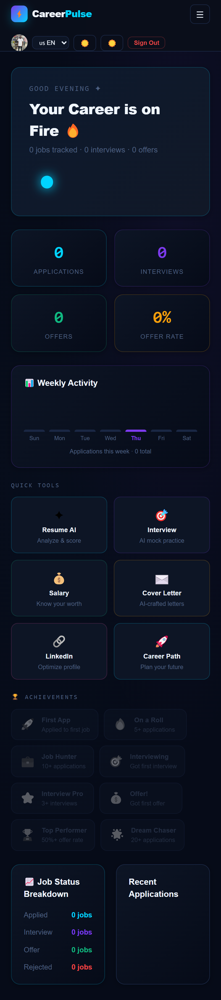
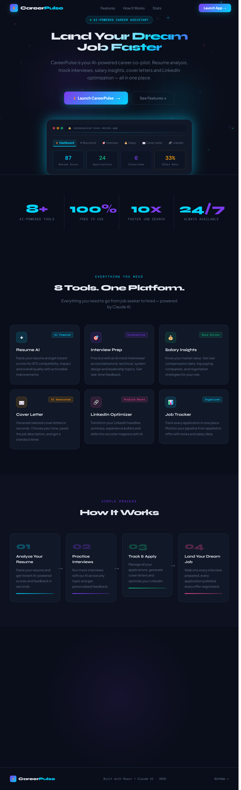
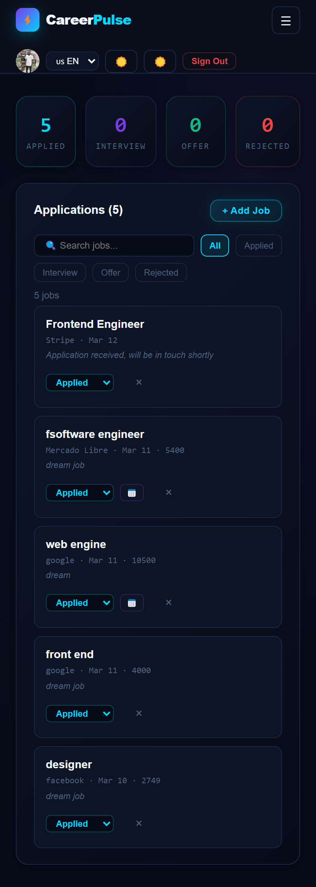
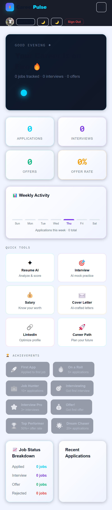
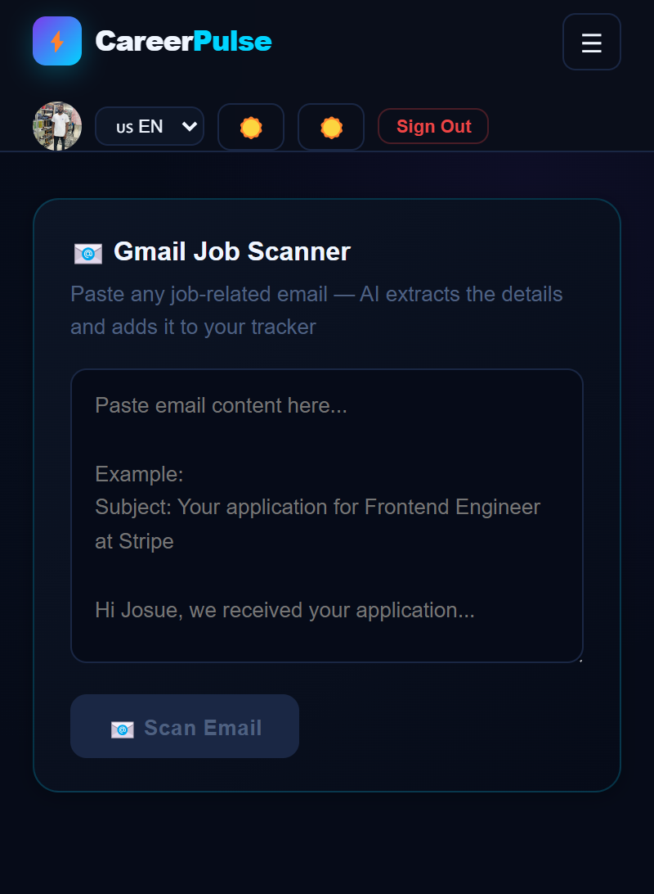
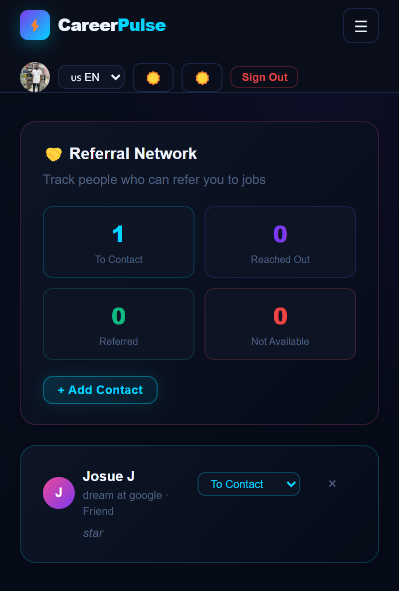

# CareerPulse 🚀
### AI-Powered Career Assistant Platform

> Track jobs, prep for interviews, match your resume to job descriptions, and land your dream role — all in one place.

🔗 **Live Demo:** [careerpulse-rose.vercel.app](https://careerpulse-rose.vercel.app)

---

## 📸 Screenshots

| Landing Page | Dashboard |
|---|---|
|  |  |

| Job Tracker | Job Match AI |
|---|---|
|  |  |

| Gmail Scanner | Referral Network |
|---|---|
|  |  |

---

## ✨ Features

### 🤖 AI-Powered
- **Resume AI** — Get your resume scored and improved by Claude AI
- **Interview Prep** — Practice with AI-generated interview questions
- **Career Path** — Get personalized career roadmap suggestions
- **Job Match Score** — Paste a job description and get a % match with your resume
- **Gmail Scanner** — Paste a recruiter email and auto-extract job details to your tracker
- **Cover Letter Generator** — AI-written cover letters tailored to each job

### 📊 Job Tracking
- **Job Tracker** — Track all your applications with status updates (Applied → Interview → Offer)
- **Search & Filter** — Search by company or title, filter by status
- **Interview Notes** — Add notes to each job (questions asked, feedback, next steps)
- **Deadline Reminders** — Get browser notifications for upcoming deadlines
- **Google Calendar Sync** — Add job deadlines directly to your Google Calendar

### 🏆 Progress & Analytics
- **Dashboard** — Real-time stats: applications, interviews, offers, offer rate
- **Weekly Activity Chart** — Visual breakdown of your job search activity
- **Achievement Badges** — Unlock badges as you progress (First App, Job Hunter, Offer!, etc.)

### 🤝 Network
- **Referral Tracker** — Track contacts who can refer you, update their status
- **LinkedIn Helper** — Optimize your LinkedIn profile with AI suggestions
- **Salary Insights** — Research salary ranges for your target roles

### 🌍 User Experience
- **5 Languages** — English, Spanish, Portuguese, French, German
- **Dark / Light Mode** — Toggle between themes
- **Mobile Responsive** — Full hamburger menu on mobile
- **Share Resume** — Generate a public link to share your resume
- **PDF Export** — Download your resume as a PDF

---

## 🛠️ Tech Stack

| Layer | Technology |
|---|---|
| Frontend | React + Vite |
| Styling | Inline CSS with design tokens |
| Auth | Firebase Authentication (Google Sign-In) |
| Database | Firebase Firestore (real-time) |
| AI | Anthropic Claude API (claude-sonnet-4-20250514) |
| Job Search | Adzuna Jobs API |
| Deployment | Vercel (Serverless Functions) |

---

## 🚀 Getting Started

### Prerequisites
- Node.js 18+
- Firebase project
- Anthropic API key
- Adzuna API credentials

### Installation

```bash
# Clone the repository
git clone https://github.com/Josueize/careerpulse.git
cd careerpulse

# Install dependencies
npm install

# Start development server
npm run dev
```

### Environment Variables

Create a `.env` file in the root directory:

```env
ANTHROPIC_API_KEY=your_anthropic_api_key
ADZUNA_APP_ID=your_adzuna_app_id
ADZUNA_API_KEY=your_adzuna_api_key
```

### Firebase Setup

Update `src/firebase.js` with your Firebase config:

```js
const firebaseConfig = {
  apiKey: "your_api_key",
  authDomain: "your_project.firebaseapp.com",
  projectId: "your_project_id",
  storageBucket: "your_project.appspot.com",
  messagingSenderId: "your_sender_id",
  appId: "your_app_id"
};
```

### Deploy to Vercel

```bash
vercel --prod
```

Set environment variables in your Vercel dashboard under **Settings → Environment Variables**.

---

## 📁 Project Structure

```
careerpulse/
├── src/
│   ├── App.jsx               # Auth routing + SharedResumeViewer
│   ├── CareerPulseApp.jsx    # Main app (all tabs + components)
│   ├── LandingPage.jsx       # Landing page
│   ├── firebase.js           # Firebase config
│   └── db.js                 # Firestore CRUD helpers
├── api/
│   ├── claude.js             # Vercel serverless Claude proxy
│   └── jobs.js               # Vercel serverless Adzuna proxy
├── screenshots/              # App screenshots
├── public/
└── index.html
```

---

## 🗺️ Roadmap

- [ ] Export job data as CSV
- [ ] Stripe payments for Pro tier
- [ ] Custom domain
- [ ] Email digest of weekly progress
- [ ] Browser extension for one-click job saving

---

## 👨‍💻 Author

**Izehiuwa Igiebor Omogiate (Josue)** ❤️

- GitHub: [@Josueize](https://github.com/Josueize)
- Live: [careerpulse-rose.vercel.app](https://careerpulse-rose.vercel.app)

---

## 📄 License

MIT License — feel free to use and build on this project.
